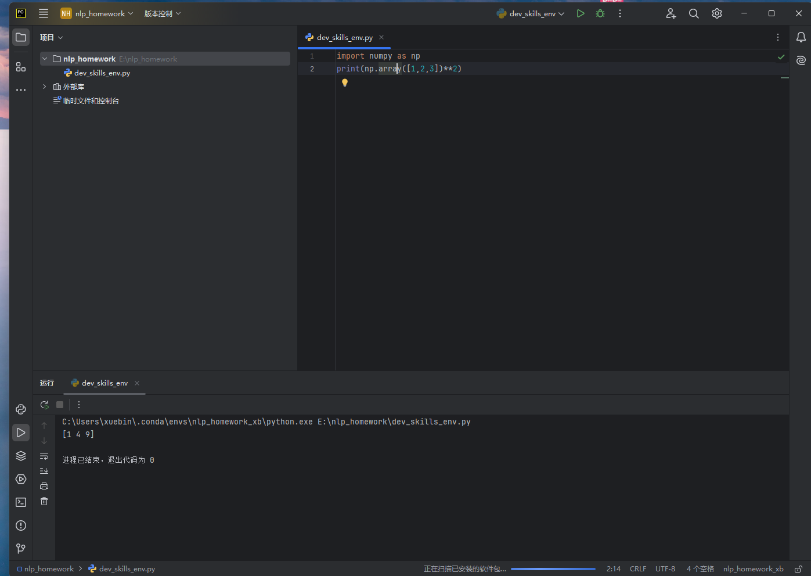

#  二二的自我介绍


大家好，我是**二二**，和我妹妹是*哔哩哔哩*的吉祥物，以下是我的自我介绍：

---

## 基础档案

### 外貌特征

- 发色：蓝发
- 瞳色：红瞳
- 身高：160cm
- 体重：48kg
- 生日：8月16日
- 星座：狮子座
- 呆毛：二二的呆毛是闪电型的，这与哔哩哔哩的“电击使”主题相符。
- 发饰：头发上夹着一个小电视发夹。
- 服装风格：通常穿着带有哔哩哔哩元素的服装，如带有哔哩哔哩标志的制服。
- 配饰：佩戴白色手套，穿着黑色过膝袜。

### 我的好朋友

1. 三三
2. 小电视君
3. ~~博主们~~

### 重要坐标

- 🏠**住址**:[哔哩哔哩](https://baike.baidu.com/item/%E5%93%94%E5%93%A9%E5%93%94%E5%93%A9/8018053)
- 🏢**工作单位**:[B站公司](https://ir.bilibili.com/cn/corporate-information/)

### 日常作息表

| 时间       |事项              |
|----------|-------------------|
| 8:00 AM  |起床直接到工作岗位    |
| 10:00 AM |数一数还有多少硬币     |
| 3:00 PM  |给喜欢的作品点赞      |
| 6:00 PM  |下班和三三一起去吃饭   |

### 人生信条

> "在哪里跌倒了，就在哪里躺会。"

## 我的专业是人工智能

### 我最喜欢的代码

```python
import numpy as np
print(np.array([1, 2, 3]) ** 2)
```
其中执行`print(np.array([1, 2, 3]) ** 2)`可输出结果。

### 我最喜欢的环境管理工具是conda


### 我可以在IDE上使用我建立的虚拟环境



