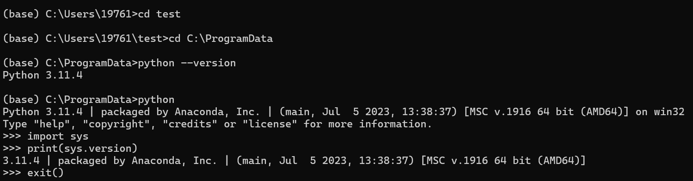
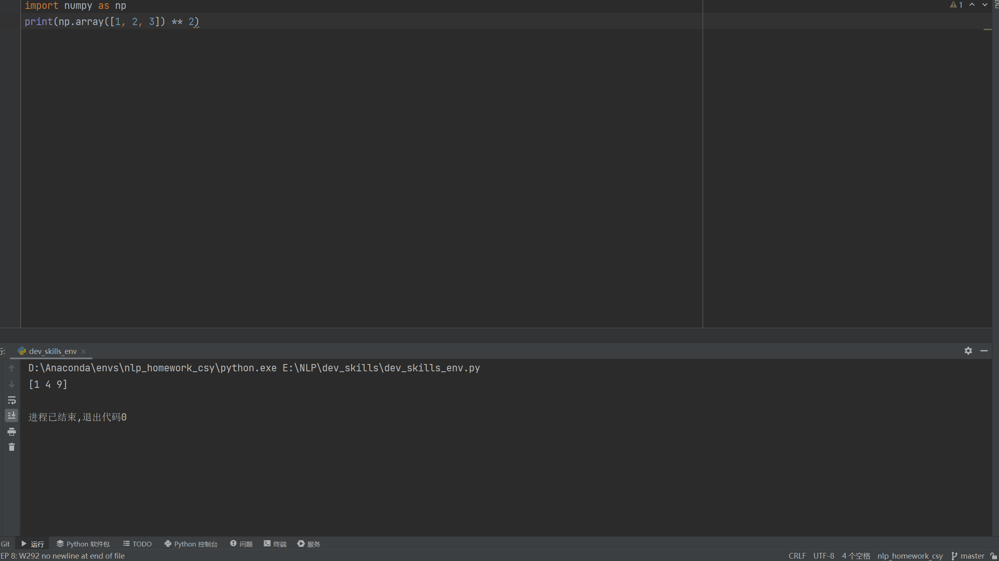

#  三三的自我介绍


大家好，我是**三三**，和我妹妹是*哔哩哔哩*的吉祥物，以下是我的自我介绍：

---

## 基础档案

### 外貌特征

- 发色：白发
- 瞳色：红瞳
- 身高：158cm
- 体重：48kg
- 生日：5月20日
- 星座：狮子座
- 呆毛：三三的呆毛是翘起来的。
- 发饰：头发上夹着一个小爱心发夹。
- 服装风格：通常穿着带有哔哩哔哩元素的服装，如带有哔哩哔哩标志的制服。
- 配饰：佩戴白色手套，穿着黑色过膝袜。

### 我的好朋友

1. 三三
2. 小电视君
3. ~~博主们~~

### 重要坐标

- 🏠**住址**:[哔哩哔哩](https://baike.baidu.com/item/%E5%93%94%E5%93%A9%E5%93%94%E5%93%A9/8018053)
- 🏢**工作单位**:[B站公司](https://ir.bilibili.com/cn/corporate-information/)

### 日常作息表

| 时间       | 事项         |
|----------|------------|
| 8:00 AM  | 起床直接到工作岗位  |
| 10:00 AM | 摸鱼         |
| 3:00 PM  | 给喜欢的作品点赞   |
| 6:00 PM  | 下班和三三一起去吃饭 |

### 人生信条

> "累了就该睡了"

## 我的专业是人工智能

### 我最喜欢的代码

```python
import numpy as np
print(np.array([1, 2, 3]) ** 2)
```
其中执行`print(np.array([1, 2, 3]) ** 2)`可输出结果。

### 我最喜欢的环境管理工具是conda



### 我可以在IDE上使用我建立的虚拟环境



